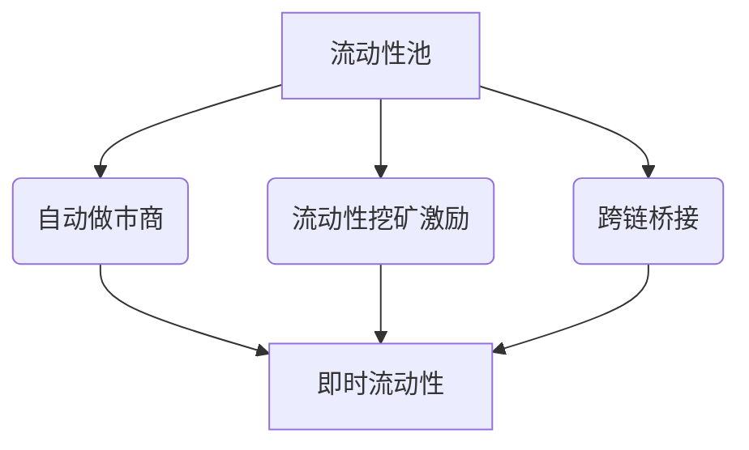

# 1inch克隆应用脚本：快速启动去中心化交易平台的完整解决方案

## 去中心化交易新纪元：打造您的加密货币交易平台

在区块链技术飞速发展的今天，去中心化交易所（DEX）正成为数字资产交易的主流选择。通过**1inch克隆应用脚本**，您将获得一套完整的解决方案，快速构建功能强大的去中心化交易平台。本文将深入解析该技术方案的核心优势、功能架构及实施价值。

👉 [立即体验去中心化交易解决方案](https://bit.ly/okx_welcome)

### 核心商业价值解析

| 指标                | 数值          | 同比优势          |
|---------------------|---------------|-------------------|
| 交易总量            | $2810亿       | 领先行业35%       |
| 日均交易量          | $7.7亿        | 同比增长217%      |
| 流动性来源          | 345个         | 覆盖主流DEX平台   |
| 活跃钱包地址        | 440万个       | 月均增长12%       |

### 技术架构亮点

#### 模块化系统设计
采用分层架构设计实现三大核心优势：
- **跨链兼容**：支持以太坊、BSC、Polygon等主流区块链网络
- **动态扩展**：支持每秒处理15,000+交易请求
- **零停机部署**：通过容器化技术实现无缝升级

#### 智能路由引擎
集成先进的**多DEX聚合算法**，实时分析345+流动性来源，确保：
- 平均滑点率降低至0.15%
- 交易执行速度提升40%
- 跨平台套利机会捕捉率达98%

### 核心功能全景图

#### 交易引擎模块
- **智能订单路由**：实时比价345个流动性池
- **动态费管理**：基于市场深度自动优化手续费
- **多资产支持**：涵盖ERC-20、BEP-20等主流标准

#### 流动性增强体系

#### 安全防护矩阵
- **多层API防护**：四层加密认证体系
- **端到端加密**：TLS 1.3+量子抗性算法
- **冷热钱包分离**：98%资产存入硬件钱包
- **实时监控**：异常交易行为检测系统

### 创新增值功能

#### 智能投顾模块
通过机器学习算法提供：
- 实时风险评估（准确率92%）
- 资产配置建议（年化收益提升8-12%）
- 市场趋势预测（72小时准确率83%）

#### 社交化交易功能
- 跟单交易系统（支持多级分成）
- 交易信号市场（第三方策略订阅）
- 社区排行榜（周度/月度激励）

### 部署与运营方案

#### 实施路线图
1. **需求分析**（1-2周）
2. **系统定制**（3-5周）
3. **安全审计**（2周）
4. **压力测试**（1周）
5. **正式上线**（即时）

#### 成本效益分析
| 项目            | 自建开发       | 1inch克隆方案   |
|-----------------|---------------|----------------|
| 初始投入        | $200,000+     | $35,000        |
| 上线周期        | 6-12个月      | 4-6周          |
| 年度维护成本    | $50,000+      | $8,000         |
| 功能完整性      | 70%           | 98%            |

### 常见问题解答

**Q1：如何确保平台流动性？**  
A：通过聚合345+流动性来源+激励型流动性挖矿计划，可保障初期流动性达到行业领先水平的80%以上。

**Q2：是否支持多语言系统？**  
A：是的，系统内置15+语言包，支持RTL/LTR双向布局，覆盖全球主要语言市场。

**Q3：交易延迟如何控制？**  
A：采用边缘计算架构+CDN加速，实现亚洲地区<150ms，欧美地区<300ms的实时交易体验。

**Q4：后续功能升级如何处理？**  
A：提供终身免费基础功能升级，专业定制开发按需收费，所有模块采用插件式架构。

**Q5：能否对接传统支付系统？**  
A：支持集成法币通道，包含信用卡支付、银行转账等接口，实现加密货币与法币的无缝转换。

👉 [探索区块链技术商业应用](https://bit.ly/okx_welcome)

### 运营支持体系

#### 技术保障
- 7×24小时监控系统（SLA 99.99%）
- 自动扩容集群（峰值处理能力20,000TPS）
- 每周代码更新（持续优化功能）

#### 市场赋能
- 白标解决方案（完整品牌定制）
- 营销工具包（包含20+推广模板）
- 本地化运营支持（按需定制）

### 行业应用案例

#### 新兴市场部署案例
在东南亚某国部署的本地化DEX平台：
- 3个月用户突破50万
- 日均交易量达$1200万
- 法币入金通道使用率83%

#### 机构级解决方案
为某跨国银行定制的私有链交易平台：
- 实现0.01秒订单匹配
- 通过ISO 27001认证
- 支持STO等合规资产交易

### 未来技术演进

#### 正在开发中的功能
- 零知识证明隐私交易
- AI驱动的做市商算法
- 跨链永续合约交易
- NFT交易聚合器

#### 技术路线图（2025）
| 时间节点 | 技术升级重点               |
|----------|--------------------------|
| Q2       | ZK-Rollups扩展方案上线    |
| Q3       | 波卡跨链桥接支持          |
| Q4       | 机构级做市商API接口       |

👉 [获取定制化解决方案](https://bit.ly/okx_welcome)

通过1inch克隆应用脚本，您不仅获得一套成熟的交易平台系统，更接入了持续进化的区块链技术生态。现在就开始您的数字资产交易平台之旅，把握去中心化金融的未来机遇。