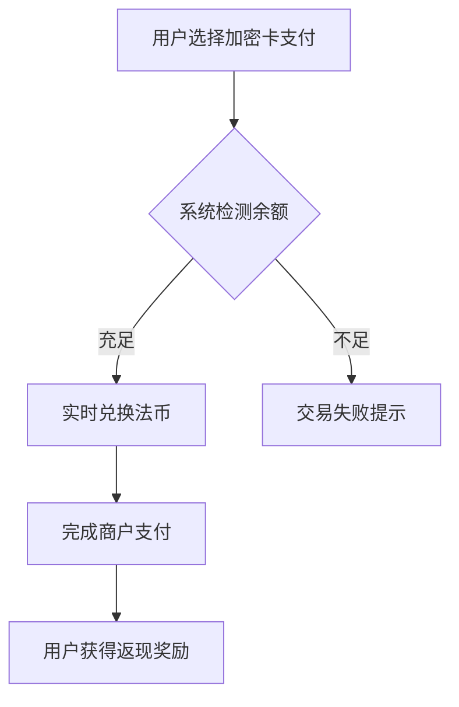

# 加密货币金融卡：一卡解锁数字资产消费新场景

## 什么是加密货币金融卡？

加密货币金融卡是连接区块链世界与现实消费场景的重要桥梁。这种与Visa或Mastercard联合发行的实体/虚拟卡片，能够将用户持有的加密资产实时转换为法定货币进行消费。区别于传统信用卡的信用透支模式，其采用"先储值后消费"的签账卡机制，直接从用户绑定的加密钱包或交易所账户扣款。

这类创新金融工具的出现，标志着加密货币正在从投资标的向支付手段转型。全球已有超过3200万用户通过加密卡实现日常消费，2023年交易总额突破450亿美元。

👉 [探索领先的加密资产支付解决方案](https://bit.ly/okx_welcome)

## 运作原理全解析

1. **资产绑定**：用户将BTC/ETH/USDT等主流币种转入指定钱包或交易所账户
2. **实时兑换**：刷卡时系统自动按即时汇率将加密货币转换为当地法币
3. **完成支付**：商户收到等值法币，用户加密资产相应减少
4. **特色功能**：部分平台提供1-8%的币本位返现，支持Apple Pay/Google Pay

典型交易流程示例：

## 加密卡 vs 传统信用卡对比

| 维度        | 加密货币金融卡               | 传统信用卡               |
|-------------|-----------------------------|--------------------------|
| 资金来源    | 加密资产预充值              | 银行授信额度             |
| 支付时效    | 实时扣款                    | 账单周期结算             |
| 发卡门槛    | 无需信用审查                | 需征信及收入证明         |
| 安全特性    | 币价波动影响购买力          | 盗刷可冻结账户           |
| 回馈机制    | 币本位返现/NFT奖励          | 积分/现金返还            |
| 跨境支付    | 天然支持多币种结算          | 涉及外汇转换手续费       |

## 市场主流产品横向测评

| 平台          | 支持币种          | 返现比例 | 特色功能                  | 年费政策       |
|---------------|-------------------|----------|---------------------------|----------------|
| Crypto.com    | 20+主流币种       | 1-5%     | Netflix/Spotify补贴       | 消费额抵扣     |
| 币安卡        | 币安全平台资产    | 高达8%   | Visa全球网络              | 无年费         |
| Wirex         | BTC/ETH/USDC等    | 0.5-2%   | ATM取现+移动端管理        | 首年免费       |
| BitPay        | BTC/BCH/DAI       | 1%       | 美国市场专用              | 实体卡$5       |
| Coinbase      | 10+合规币种       | 动态计算 | 美欧合规支付通道          | $4.95月费      |

## 使用注意事项与风险提示

### 汇率波动风险
加密市场剧烈波动可能影响实际购买力。例如比特币价格在1小时内波动5%时，消费金额会产生明显差异。建议在资产配置中保留至少20%的稳定币储备。

### 手续费结构解析
典型收费项目包含：
- 跨链转账费（$0.1-$2）
- 法币兑换手续费（0.5-3%）
- ATM取现费（$1-$5/次）
- 实体卡制作费（$5-$15）

👉 [获取零手续费交易指南](https://bit.ly/okx_welcome)

### 税务合规要点
根据多数国家的加密资产监管政策：
- 持有超过1年的数字资产消费可能适用长期资本利得税
- 日常小额消费通常免税（如单日$50以下）
- 企业账户需单独申报加密资产损益
建议使用专业的税务软件（如CryptoTax）进行交易记录管理。

### 安全防护策略
1. 启用双重认证（2FA）
2. 定期更新支付密码
3. 开启交易限额设置
4. 使用硬件钱包冷存储
5. 关注官方安全公告

## 适用人群画像

**推荐用户群体：**
- 持有BTC/ETH超过3个月的投资者
- 有跨境支付需求的跨境电商卖家
- 数字游民群体（年均海外消费$10k+）
- 区块链行业从业者（工资以加密货币支付）

**新手过渡方案：**
1. 先通过虚拟卡进行小额测试
2. 设置单日消费上限
3. 选择零年费入门级卡种
4. 开启实时交易通知

## 常见问题解答（FAQ）

**Q1：加密卡是否支持离线支付？**
A：目前主流产品均需网络连接以完成实时汇率转换，但部分平台正在测试离线支付功能，需预先加载一定额度。

**Q2：被黑客盗刷如何处理？**
A：立即通过官方App冻结卡片，并向平台提交申诉。多数服务商提供盗刷金额的50-100%赔偿保障。

**Q3：支持哪些消费场景？**
A：全球超过5200万商户支持Visa/Mastercard支付，包含线上零售（亚马逊/Steam）、线下商超（沃尔玛）、旅行预订（Expedia）等。

**Q4：如何选择最优返现方案？**
A：根据持仓币种和消费习惯匹配：
- 高频小额消费：选择稳定币返现
- 大额跨境支付：优选BTC/ETH返现
- 长期持币用户：考虑NFT奖励机制

**Q5：加密卡是否影响信用评分？**
A：由于不涉及信用借贷，使用加密卡不会影响传统征信评分。但部分平台提供加密信用评分服务，可用于未来借贷申请。

👉 [立即开通您的数字资产支付通道](https://bit.ly/okx_welcome)