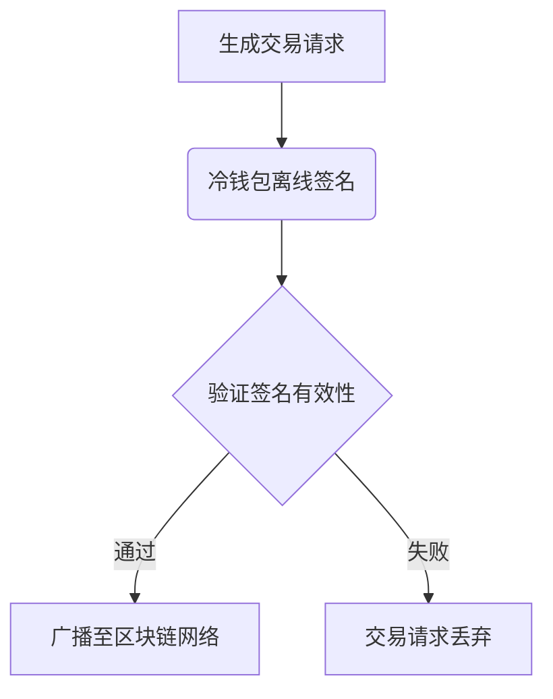

# 2025冷钱包推荐：三款值得入手的加密资产存储方案

## 冷钱包的核心价值
冷钱包（Cold Wallet）作为实体加密资产存储设备，凭借其离线特性已成为数字资产管理的重要工具。其核心优势体现在：
- **军工级安全防护**：通过EAL 6+安全认证的硬件芯片，实现私钥完全离线存储
- **资产自主掌控**：用户独占私钥管理权，规避第三方托管风险
- **物理隔离设计**：交易签名全程离线完成，阻断网络攻击路径

> 值得注意的是，冷钱包并非保险箱，而是通过"离线钥匙"机制保障资产安全，其安全性建立在私钥物理隔离基础上。

## 2025年度冷钱包精选

### 1. SafePal S1：高性价比入门首选
👉 [获取专业加密资产服务](https://bit.ly/okx_welcome)

这款获得币安战略投资的产品，特别适合加密货币新手用户。其创新性集成摄像头实现二维码秒扫功能，在保持基础操作便捷性的同时，提供：
- 支持超过10000种加密资产
- 军工级安全芯片防护
- 双系统备份机制
- 1.1英寸OLED显示屏

| 规格参数 | 基础版 |
|---------|--------|
| 屏幕尺寸 | 1.1英寸 |
| 安全认证 | EAL 6+ |
| 连接方式 | USB-C/BLE 5.0 |
| 重量 | 38g |

### 2. CoolWallet Pro：移动场景最佳拍档
台湾团队研发的卡片式冷钱包，凭借其：
- 信用卡尺寸设计（仅5.2mm厚）
- 蓝牙5.2无线连接技术
- 支持EVM/SVM等多链生态
- 双芯片安全架构

特别适合经常需要移动管理资产的专业投资者。最新版本升级了NFC近场通信功能，实现更便捷的设备配对。

### 3. Ledger Nano X：专业级硬件方案
作为行业标杆产品，其优势体现在：
- 动态PIN码保护机制
- 支持1800+种加密货币
- 专属恢复服务（Ledger Recover）
- 蓝牙5.0无线连接

配备128x64像素 OLED显示屏，支持固件热更新功能。对于持有BTC/ETH等主流资产的用户，其安全防护等级达到金融级标准。

## 技术原理深度解析
冷钱包通过三重安全机制构建防护体系：

1. **离线签名机制**

2. **密钥分片技术**：将私钥拆分为多个碎片，分别存储在安全芯片的不同区域

3. **物理防护层**：采用防篡改封装技术，任何物理破坏尝试都会触发自毁机制

## 冷钱包 vs 热钱包对比指南

| 核心指标        | 冷钱包                | 热钱包                |
|-----------------|-----------------------|-----------------------|
| 安全等级        | ★★★★★                | ★★★                   |
| 使用便捷性      | ★★                    | ★★★★★                |
| 资产控制权      | 完全自主              | 依赖服务商            |
| 适用场景        | 长期存储（>$10,000）  | 日常交易（<$1,000）    |
| 平均耗电量      | 无持续耗电            | 持续联网耗电          |

## 常见问题解答

**Q：冷钱包遗失后如何恢复资产？**
A：只需使用初始备份的助记词，在同品牌新设备上恢复即可。建议采用金属助记词备份方案，可抵御火灾等物理损害。

**Q：如何防范钓鱼攻击？**
A：每次交易需在设备实体按键确认，任何网络钓鱼攻击都无法绕过该物理确认环节。

**Q：冷钱包需要定期更换吗？**
A：建议每3-5年更新设备，以获取最新的安全防护特性。如Ledger已推出设备以旧换新计划。

**Q：是否需要联网更新固件？**
A：固件更新需通过有线连接完成，所有更新包均采用多重签名验证机制。

**Q：如何验证设备真伪？**
A：主流品牌均提供多重防伪验证：
- 二维码真伪认证
- 包装盒全息防伪标签
- 官网序列号验证

## 选择指南与建议
对于不同资产规模的用户，推荐配置方案：

| 资产规模       | 推荐方案                  | 安全建议                     |
|----------------|---------------------------|------------------------------|
| <$5,000        | CoolWallet Pro            | 热钱包+冷钱包组合使用        |
| $5,000-$50,000 | Ledger Nano X             | 启用双重认证+异地备份        |
| >$50,000       | SafePal S1+Ledger双备份   | 保险柜级物理存储+多签方案    |

👉 [了解更多安全存储方案](https://bit.ly/okx_welcome)

## 行业发展趋势
2025年冷钱包技术呈现三大革新方向：
1. **生物识别集成**：部分厂商已测试指纹识别+冷钱包融合方案
2. **跨链聚合管理**：支持Cosmos/Polkadot生态的多链管理功能
3. **DeFi直连协议**：内置DApp浏览器实现去中心化金融操作
