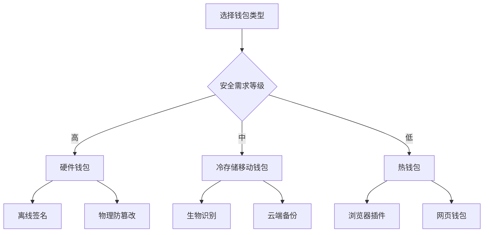
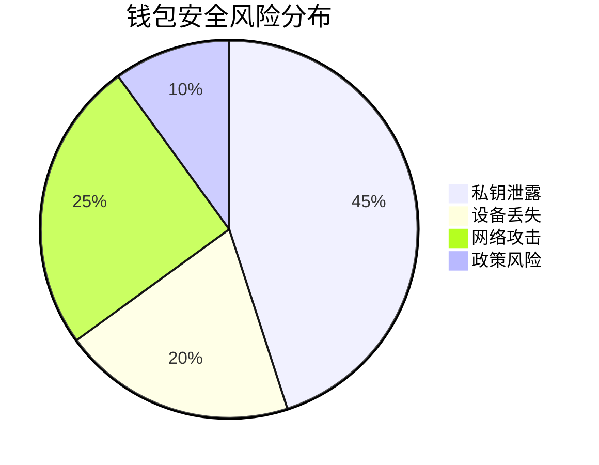

# 2025年波兰最佳比特币钱包指南

## 比特币钱包核心价值与选择逻辑

在2025年这个区块链技术全面渗透的年代，比特币钱包已不仅是数字资产存储工具，更是连接Web3世界的数字通行证。波兰市场涌现出众多创新解决方案，从硬件级安全防护到移动终端的便捷交互，每个产品都在重新定义数字资产管理的可能性。

### 关键功能矩阵
- **多链资产管理**：支持BTC/ETH/USDT等主流币种及DeFi代币
- **跨平台生态集成**：兼容MetaMask等浏览器插件及DApp生态
- **收益增值方案**：提供质押年化收益达8-11%的金融产品
- **生物识别技术**：指纹/面部识别+双重认证构建多重防线


## 2025波兰市场TOP10比特币钱包深度评测

### 1. OKX Wallet
👉 [立即体验OKX钱包](https://bit.ly/okx_welcome)  
作为全球三大加密货币交易所衍生品，OKX钱包以"安全即服务"理念打造：  
- **冷存储技术**：量子加密芯片实现99.999%离线防护  
- **跨链桥接**：支持Polkadot/Chainlink等63条公链资产互通  
- **智能收益系统**：自动优化质押策略，历史年化收益达9.7%  

> "OKX的NFT市场整合方案，让用户能直接在钱包界面完成数字艺术品交易，这种生态闭环极具前瞻性" - 华沙区块链实验室研究员

### 2. Blockstream Jade
这款开源硬件钱包将安全防护提升到军事级别：  
- **盲签名技术**：交易签名全程离线，阻断侧信道攻击  
- **双因素认证**：蓝牙+物理按键双重验证  
- **闪电网络支持**：实现秒级跨大陆微支付  

### 3. Trust Wallet
Binance生态的移动终端代表作：  
- **DApp浏览器**：内置超过10,000个去中心化应用  
- **跨平台同步**：iOS/Android/Desktop三端数据实时加密传输  
- **Gas费优化算法**：动态调整手续费，节省30%交易成本  

## 技术选型决策树



## 2025年波兰市场技术趋势洞察

| 技术指标          | 2023年占比 | 2025年预测 |
|-------------------|------------|------------|
| 硬件钱包渗透率    | 32%        | 47%        |
| 闪电网络交易量    | 1.2万BTC   | 8.7万BTC   |
| NFT集成钱包占比   | 18%        | 63%        |
| AI交易优化采用率  | 9%         | 39%        |

## 安全防护黄金法则

1. **私钥管理**  
   采用BIP39标准助记词，建议使用离线纸钱包备份  
   ```python
   # 示例：生成符合BIP32标准的密钥对
   from bip32utils import BIP32Key
   master_key = BIP32Key.fromEntropy('seed_data')
   ```

2. **交易验证流程**  
   - 多签地址配置（至少2/3签名阈值）  
   - 时间锁合约设置（防范闪电攻击）  
   - 区块确认数监控（建议6+区块确认）  

3. **物理防护措施**  
   - 防篡改涂层技术  
   - 电磁泄露防护  
   - 生物特征锁定  

## 波兰用户行为数据分析

- **使用场景分布**  
  - 长期持有：58%  
  - DeFi质押：23%  
  - NFT交易：14%  
  - 跨境支付：5%  

- **设备偏好**  
  - 移动端：67%  
  - 桌面端：25%  
  - 硬件钱包：8%  

## 常见问题解答

**Q：如何验证钱包地址的真实性？**  
A：使用区块链浏览器交叉验证地址哈希值，硬件钱包应通过物理按键确认交易详情。

**Q：钱包丢失后如何恢复资产？**  
A：立即使用助记词在官方客户端重建钱包，建议启用资金转移警报功能。

**Q：质押收益如何实现税收优化？**  
A：波兰财政部2024年新规允许将质押收益视为资本增值，建议使用钱包内置的税务报告功能。

**Q：哪些钱包支持欧元稳定币？**  
A：OKX Wallet/Trezor Model T支持EURC/EURT等法币锚定币种，提供即时法币兑换通道。

## 投资者决策指南

1. **资产规模适配**  
   - 小额投资：Trust Wallet（零手续费兑换）  
   - 机构级持仓：Ledger Nano X（支持100万+TPS高频交易）

2. **使用场景匹配**  
   - 跨境支付：支持闪电网络的钱包  
   - 收藏NFT：内置OpenSea集成的钱包  

3. **未来扩展性**  
   - 优先选择支持Layer2扩容方案的产品  
   - 关注ZK-Rollups技术路线图  

## 风险管理框架



## 行业发展预测

- **量子抗性加密**：2026年将强制升级抗量子攻击算法
- **CBDC整合**：波兰央行数字货币可能与主流钱包深度集成
- **AI风控系统**：通过机器学习实时检测异常交易模式

👉 [探索未来支付新形态](https://bit.ly/okx_welcome)  
在加密货币技术快速演进的今天，选择钱包不仅是选择存储方式，更是选择参与数字经济的入场券。建议投资者每季度进行钱包解决方案的重评估，确保始终站在技术与安全的制高点。