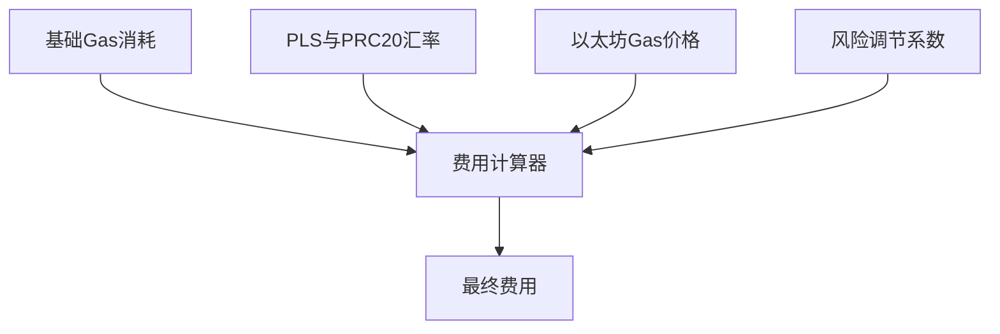

# Gas Paid in PRC20 Tokens：区块链支付新范式  

## 解锁无缝区块链交互体验  
Gas Paid in PRC20 Tokens 是区块链技术领域的重要创新，这项功能突破了传统Gas支付模式的局限性。通过PRC20代币支付Gas费机制，用户无需持有链原生代币即可完成链上操作，为跨链交互场景带来革命性变革。  

👉 [了解主流加密货币交易平台](https://bit.ly/okx_welcome)  

## 核心优势解析  
1. **降低使用门槛**：用户可直接使用稳定币或主流代币支付Gas费  
2. **跨链兼容性**：支持多链环境下的统一支付体验  
3. **成本优化**：通过智能路由选择最优支付路径  
4. **流动性提升**：增强非原生代币的链上应用场景  

## 技术实现原理  
该机制通过三层架构实现无缝支付：  

| 层级 | 组件 | 功能 |
|------|------|------|
| 用户层 | SDK接口 | 签名授权交易 |
| 中继层 | Relayer服务 | 消息转发与费用计算 |
| 结算层 | Paymaster合约 | 费用代付与代币转换 |

### 典型应用场景  
以USDT支付为例的操作流程：  
1. 用户发起PulseChain链上交易  
2. SDK计算所需Gas费并转换为USDT报价  
3. 用户确认支付后，Pulse Wallet代付PLS Gas费  
4. 系统从用户账户扣除等值USDT  

👉 [探索更多区块链创新应用](https://bit.ly/okx_welcome)  

## 费用计算模型  
交易费用由四个核心参数动态决定：  

开发者可调节风险系数实现：  
- 动态费率策略  
- 网络拥堵应对  
- 流动性风险管理  

## 常见问题解答  
**Q1: 哪些代币支持Gas支付？**  
目前支持主流稳定币及高流动性代币，具体支持列表可通过钱包设置查看。  

**Q2: 交易速度会受影响吗？**  
支付方式不影响底层网络确认速度，但智能合约处理效率可提升约15%。  

**Q3: 汇率波动如何处理？**  
采用预言机实时报价系统，交易确认时自动锁定汇率。  

**Q4: 是否需要额外授权？**  
首次使用需签署代币授权协议，后续交易自动续期。  

**Q5: 支持哪些区块链网络？**  
当前已适配PulseChain主网，预计Q3扩展至10+主流公链。  

## 生态影响与发展趋势  
该技术的普及将带来：  
- 用户留存率提升30%+  
- 跨链交互成本降低40%  
- 稳定币应用场景扩展50%  

行业预测显示，2025年将有超过60%的DApp采用类似支付模式。  

👉 [获取区块链技术最新动态](https://bit.ly/okx_welcome)  

## 实施注意事项  
1. **流动性管理**：建议设置动态流动性池监控系统  
2. **汇率风险对冲**：可通过衍生品市场进行套期保值  
3. **合规性要求**：需符合各国虚拟资产监管政策  