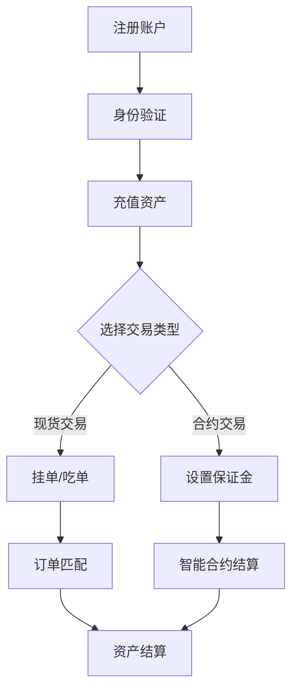

# 加密货币交易所是什么及运作方式详解

## 什么是加密货币交易所？

加密货币交易所是数字资产交易的核心平台，其本质是连接买家与卖家的交易中介。用户可通过这类平台实现加密货币与法币的双向兑换、数字资产间的跨币种交易等功能。作为区块链技术与金融交易的结合体，交易所支撑着全球超2万种加密货币的流动性供给。

### 核心功能解析
- **撮合交易**：通过订单簿或自动做市商（AMM）机制实现买卖双方的高效匹配
- **资产托管**：为用户提供数字钱包服务（尤其适用于中心化交易所）
- **价格发现**：实时反映市场供需关系的动态定价系统
- **衍生品支持**：部分平台提供期货、期权等金融衍生工具

👉 [深入了解OKX交易平台](https://bit.ly/okx_welcome)

---

## 交易所的发展历程

2009年比特币诞生后，首个交易平台BitcoinMarket.com的出现标志着行业萌芽。2013年Mt.Gox交易所的崩盘事件促使行业开始重视风控体系建设。2020年DeFi（去中心化金融）浪潮催生了Uniswap等自动做市商模式，推动交易所形态向多维度进化。

### 关键发展阶段
| 时间节点 | 里程碑事件 | 行业影响 |
|---------|-----------|---------|
| 2010年 | 第一个比特币交易所上线 | 建立基础交易框架 |
| 2013年 | Mt.Gox破产事件 | 促进行业安全标准建立 |
| 2017年 | ICO热潮 | 推动交易所数量激增 |
| 2020年 | DeFi兴起 | 催生新型交易模式 |

---

## 交易所的两大类型

### 中心化交易所（CEX）

**运作机制**：交易所作为可信第三方，集中管理用户资产与交易数据。通过订单簿匹配系统实现实时交易，典型代表如OKX、Binance等。

**优势特征**：
- 日均交易量超400亿美元的流动性保障
- 支持法币与加密货币直接兑换
- 提供止损单、限价单等专业交易工具
- 完善的客服与纠纷处理机制

**风险防控**：
- 采用冷钱包存储98%以上用户资产
- 实施多因素身份验证（2FA）
- 建立保险储备基金应对极端风险

👉 [体验OKX专业交易功能](https://bit.ly/okx_welcome)

### 去中心化交易所（DEX）

**运作原理**：基于智能合约的自动化交易协议，用户通过区块链钱包直接交易。Uniswap、SushiSwap等采用自动做市商（AMM）模型，通过流动性池机制实现交易。

**创新特点**：
- 用户完全掌控私钥与资产
- 交易记录永久存储在区块链上
- 支持长尾代币的无障碍上市
- 创造性引入流动性挖矿机制

**使用场景**：
- 适合持有小众加密货币的用户
- 注重隐私保护的高净值投资者
- DeFi生态参与者

---

## 交易所运作机制全解析

### 交易流程图解

### 订单处理机制
1. **订单簿模式**：买卖双方报价按价格优先级排序，当买价≥卖价时撮合成交
2. **做市商机制**：流动性提供者（LP）注入资产池，通过算法公式确定价格
3. **滑点控制**：设置最大可接受价格波动范围（通常为0.5%-2%）
4. **手续费结构**：0.1%-0.5%的阶梯式费率，大额交易可享折扣

---

## 2024年全球主流交易所排名

### 中心化交易所TOP5
| 平台名称 | 日均交易量 | 核心优势 |
|---------|------------|---------|
| OKX | $25.8B | 金融产品最全 |
| Binance | $22.3B | 币种覆盖最广 |
| Coinbase | $5.7B | 合规性标杆 |
| Bybit | $8.2B | 衍生品创新 |
| KuCoin | $6.5B | 新项目首发 |

### 去中心化交易所TOP5
1. **Uniswap**：TVL（总锁定价值）达$45亿，首创V3集中流动性模型
2. **Curve Finance**：专注稳定币兑换，低滑点设计
3. **Balancer**：支持多资产流动性池配置
4. **SushiSwap**：社区治理典范
5. **PancakeSwap**：BSC链头部平台

---

## 如何选择优质交易所？

### 安全性评估维度
- **技术防护**：是否具备分布式架构抵御DDoS攻击
- **审计认证**：是否通过CertiK等权威机构智能合约审计
- **应急机制**：是否有独立保险基金（如OKX的$2000万储备）
- **历史记录**：近3年是否发生重大安全事故

### 费用对比要点
- 提现手续费：BTC网络平均$0.5，OKX最低$0.1
- 交易返佣：部分平台提供最高0.2%的返佣
- 隐藏成本：价差过大时考虑滑点损耗
- 法币通道：信用卡购币手续费差异（2%-5%）

👉 [查看OKX费率详情](https://bit.ly/okx_welcome)

---

## 常见问题解答（FAQ）

**Q：交易所的KYC验证有必要做吗？**
A：完全实名认证可解锁更高交易额度（如OKX从$2000提升至$50000/日），同时满足反洗钱监管要求。

**Q：冷存储的钱包是否绝对安全？**
A：冷存储确实能防范网络攻击，但需警惕物理层面风险。建议采用硬件钱包+多重签名的组合方案。

**Q：如何判断新交易所是否可靠？**
A：观察三大指标：注册资金是否超$500万、是否持有美国MSB牌照、是否有知名风投背景。

**Q：为什么同一币种在不同平台价格存在差异？**
A：市场深度差异导致套利机会，价差通常在0.5%-3%之间波动，专业套利者可在CEX与DEX间操作。

**Q：交易所突然暂停提币怎么办？**
A：优先确认是否为系统升级（通常提前公告），若遇突发情况应立即联系客服并转移未锁定资产。

**Q：参与流动性挖矿需要注意什么？**
A：重点防范无常损失（IL），建议选择波动率低于10%的交易对，同时关注年化收益率（APY）变化趋势。